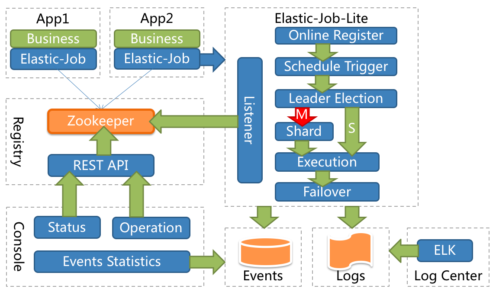
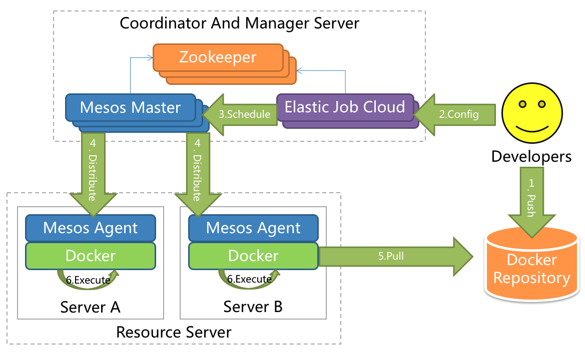

# shardingsphere-elasticjob-lite
#### 介绍
ElasticJob原来是当当网的分布式任务调度方案，从上年开始被Apache收购为子项目
[elasticjob](https://shardingsphere.apache.org/elasticjob/ "elasticjob")

### ElasticJob-Lite

### ElasticJob-Cloud

`注：ElasticJob-Cloud支持资源分配，ElasticJob-Lite不支持资源分配`
`注：ElasticJob-Cloud支持常驻，ElasticJob-Lite支持常驻+瞬时`
#### 特性
1. 弹性调度：将一个任务分片执行达到扩展
2. 资源分配(elastic-cloud)：将资源根据任务进行分配，可以在ElasticJob-Cloud看到这里的资源特指的是k8s容器，
将任务分配给容器进行执行，这个资源直接对任务进行定时任务的配置。
+ 常驻作业：不论运行时还是等待运行，一直占用资源
+ 瞬时作业：在每一次作业执行完毕后立刻释放资源
3. 作业治理：失效转移，错过作业重新执行，自诊断修复
4. 开放生态：spring整合，作业类型：数据流、脚本、文件、HTTP(V3.0新特性beta)
5. 可视化管控端：docker pull apache/shardingsphere-elasticjob-lite-ui
#### 使用说明
1. zookeeper
2. mysql
